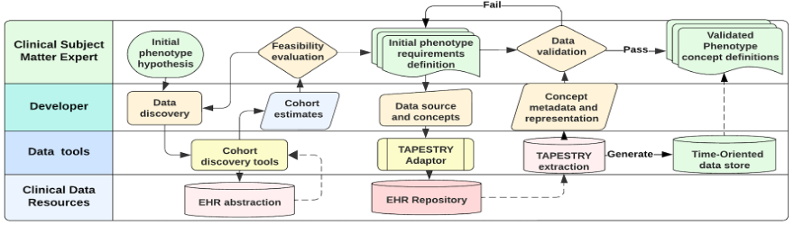

# TAPESTRY - Temporal Analytics Platform for Exploratory Scientific and Translational Research inquirY

> NOTE - We will be releasing the code here before the end of November 2024.  It is currently held up for IP review before release.

TAPESTRY is a modular, generalizable toolkit designed for clinical scientists and informatics engineers to rapidly and collaboratively develop temporally oriented patient datasets to study disease progression, treatment efficacy, and longitudinal patient care.  Temporal orientation is achieved by adopting a universal patient:time key, allowing the inclusion of patient data from any system and, notably, the seamless integration of all TAPESTY instances.  Uniquely, we envision each TAPESTRY instance as a component in a larger “data fabric” that collectively offers a scalable ability to combine and view longitudinal clinical records, each specialized to a specific domain.  To minimize expert effort and accelerate the design and deployment of analytic resources, TAPESTRY orients multi-disciplinary teams around a simple data model with expertise-specific functionality.  Clinical experts are aided by summary and annotation-ready views of temporally oriented patient clinical journeys that directly align with the in-vivo process of accumulating data into information about the disease progression over time. Developers are oriented around the same data with access to configurable and reusable data access code and algorithmic models for time-dependent analysis. The TAPESTRY interface harmonizes the two groups, providing a continuous feedback loop through embedded annotation workflows, effectively placing the collaborative experts in a loop: expert data consumers and expert data curators. This toolbox-driven approach offers the ability to lower barriers to enabling prototyping and analytics in different clinical domains. It can provide a new, technically supported platform to enhance collaboration and expertise sharing throughout an institution.

TAPESTRY instances are developed procedurally by collaborative clinical experts and informatics developers in 6 steps(See Fig 1 for a visual representation of steps and personnel):

1. Hypothesize a clinical cohort and objectives
2. Identify initial clinical data requirements to support objectives
3. Configure TAPESTRY’s data adaptors and data extraction from structured clinical data resources (Currently Clarity, OMOP, FHIR future)
4. Normalize temporal resolution through up-sampling and down-sampling data sources
5. Deploy visualization interface
6. Evaluation and annotation workflow cycle

**Figure 1: Abstract workflow of TAPESTRY data phenotyping and extraction protocol development process**

TAPESTRY has been implemented in 3 clinical domains: ICU, Cardiology, and Cancer, with broadly different goals and measurement approaches. In the ICU, vent time and end-organ function were tracked over time in 20,000 encounters to aid SOFA scoring.  Cardiology developed a means to enhance GRACE scores through time-dependent enhancements, improving prognostication in 3,000 post-MI events.  In Cancer, it was used to identify and track disease progression, including remission and relapse in 1300 Multiple Myeloma patients. In all cases, it has provided a richer ability to stratify patient risk by shifting focus to time at risk vs. previous worst-value snapshot approaches.

TAPESTRY is an effective tool for fine-grained cohort identification and selection, disease state change tracking, and rich comparative analyses.  We plan to extend this platform with greater group identification and group comparative analytics capabilities by implementing advanced techniques for event detection, forecasting, clustering, and phenotyping of time series profiles, focusing on causal reasoning.  Technically, we will achieve that using approaches such as Dynamic Time Warping and Group-Based Trajectory Partitioning.  We also plan to implement TAPESTRY in additional clinical domains to improve collaborations and take advantage of a greater diversity of thought, contributing to the platform's evolution.

## Using TAPESTRY

TAPESTRY is a python based, configuration driven, set of tools that are available for you to configure into vast array of different use-cases.  We built this to be a pragmatic toolkit that makes the process of building a time dependent clinical data registry as efficient as possible.

TAPESTRY is developer focused, meaning this is intended to accelerate data developers in the development of patient :: time centered data registries.  Your developers will need to create TAPESTRY configuration files and, in the case of the visualization layer, write some Python code.  We feel that despite these requirements, we offer an efficient option to help you perform these steps:

1. Ingest clinical data; patient:time key and payload and organize it temporally at a specific frequency - minute, hour, day, week, month.  Up or down sampling is performed at ingestion time.  After ingestion, the data is naturally in the form of a sparse matrix
    - TAPESTRY currently has 2 fully functioning data adapters:
      - Epic Clarity adapter - available by request to any site that is using the Epic EMR
      - OMOP adapter - available completely open source
    - Two additional data adapters are in development:
      - Epic Caboodle - also limited to Epic sites
      - HL7 FHIR resource adapter - will be released as fully open source
2. Make the data dense using one of few clinically relevant mechanisms
    - Extrapolate last known value forward in time until the next known value (or until there is evidence the value is no longer valid)
    - interpolate data through some other concept specific mechanism such as linear regression, or known rates of metabolism
3. Optionally extend TAPESTRY through the extensions interface with custom data
4. Clean up Reality Violations.  The process of extrapolation can cause conflicts that aren't natively in the recorded data
5. Derive New data
    - A very simple examples is splitting BP values of 110/70 into 110 systolic and 70 diastolic
    - A more complicated example is integrating multiple data streams to derive a specific disease state.
    - An even more complicated example is applying temporal clustering to uni or multivariate data streams and search for interesting clusters of patients
6. Save the matrix for additional derivation or for presentation through a dashboard
7. Present the data visually at both a population and patient level
    - Notably, this template includes In-situ annotations on the patient level page for continous human in the loop data improvement lifecycle

To understand how to implement and use TAPESTRY, please see the following pages (in suggested order):

1. [TAPESTRY data](data.md) - for more detailed information about TAPESTRY data adapters and the ingestion process
1. [TAPESTRY installation and execution](run.md) - for technical pre-reqs and how to get started with the code base

---

## Authorship
* Bill Riedl <awriedl@ucdavis.edu>
* Research Informatics - Public Health Sciences
* 2021